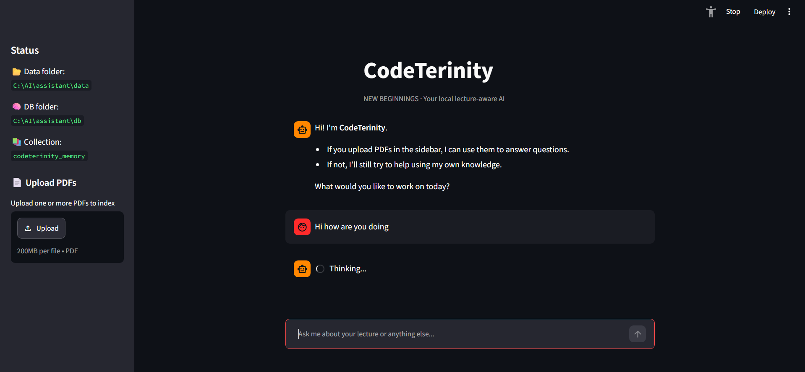

# CodeTerinity RAG Assistant

CodeTerinity is an offline Retrieval-Augmented Generation (RAG) study assistant. It lets a user build a local knowledge base from PDF files, retrieve relevant document chunks, and ask questions through a terminal or Streamlit interface.

## Project Overview

This project explores how local AI tools can support document-based learning without sending study files to a cloud service. The assistant indexes PDF content into a local ChromaDB database and uses a local LM Studio model to generate answers.



## Problem

Students often have long lecture notes or PDFs and need a faster way to search, summarise, and ask questions about the material. A normal chatbot may not know the uploaded content, while cloud tools may not be suitable for private study documents.

## Solution

CodeTerinity extracts text from local PDFs, splits the content into chunks, stores embeddings in ChromaDB, and retrieves the most relevant chunks for each question. The local language model then answers using the retrieved context when it is relevant, and falls back to general local assistant behaviour when no useful document context is found.

## Key Features

- PDF text extraction and chunking
- Local embedding generation with SentenceTransformers
- Persistent ChromaDB vector storage
- Semantic search over uploaded study material
- Retrieval-aware answers using LM Studio's local OpenAI-compatible API
- Terminal chat interface
- Streamlit interface for a more user-friendly workflow
- Distance threshold to avoid using weak or unrelated document matches

## Tech Stack

- Python
- ChromaDB
- SentenceTransformers
- pypdf
- OpenAI Python client
- LM Studio
- Streamlit

## My Contribution

- Built the PDF ingestion and chunking workflow.
- Connected the assistant to a local ChromaDB vector database.
- Implemented semantic retrieval using MiniLM embeddings.
- Integrated LM Studio through an OpenAI-compatible local API.
- Added both terminal and Streamlit-based interaction options.
- Tuned the retrieval flow so the assistant only uses document context when it is relevant.

## How to Run

1. Install dependencies:

```bash
pip install chromadb sentence-transformers pypdf openai streamlit
```

2. Place PDF files in the configured data folder.

The current code uses:

```text
C:\AI\assistant\data
```

3. Build the local memory database:

```bash
python assistant/build_memory.py
```

4. Start LM Studio locally and load the model configured in the code.

The current code expects:

```text
http://127.0.0.1:1234/v1
```

5. Run the terminal assistant:

```bash
python assistant/codeterinity.py
```

Or run the Streamlit UI:

```bash
streamlit run assistant/ui_codeterinity.py
```

## What I Learned

- How a RAG pipeline is structured from document ingestion to answer generation.
- How embeddings and semantic search can improve document question answering.
- How to connect a Python app to a local LLM through an OpenAI-compatible API.
- How to balance document-grounded answers with fallback responses when no relevant context is found.
- Why generated vector databases and source PDFs should be handled carefully before publishing a repository.
